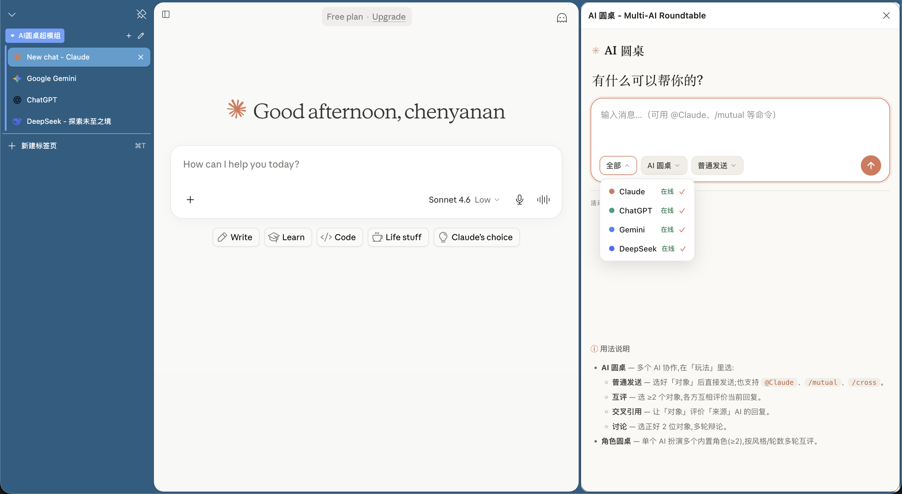
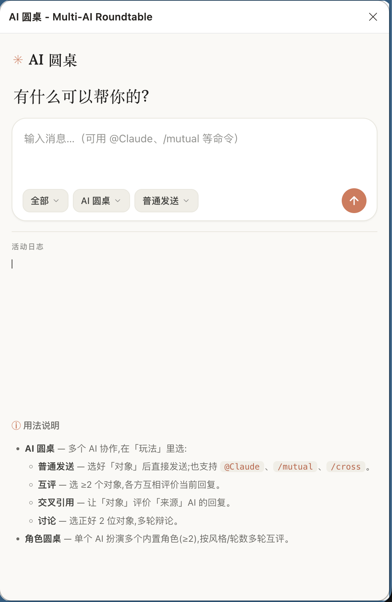
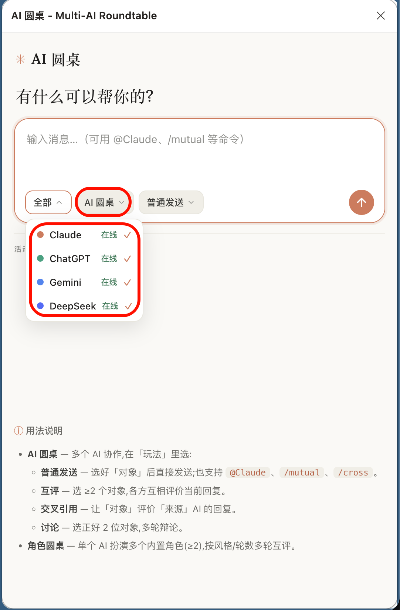
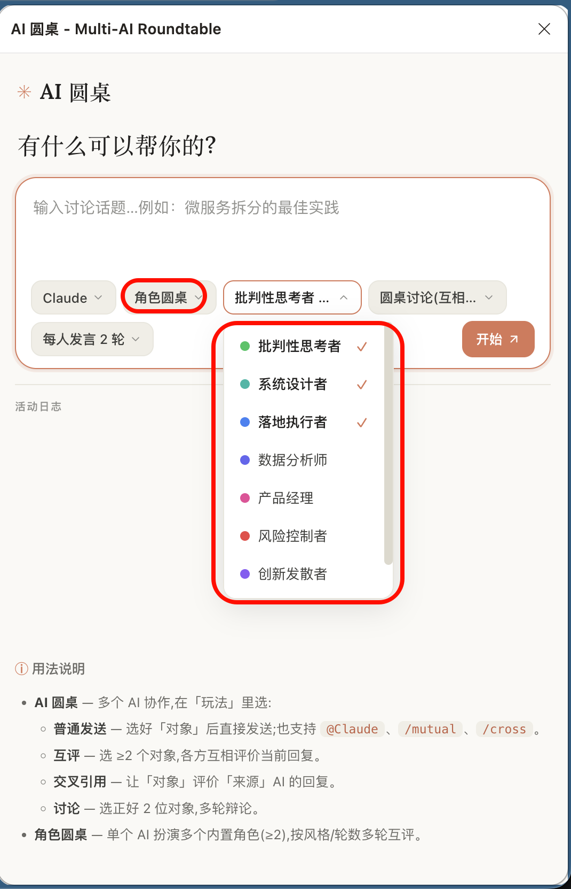

# AI 圆桌 (AI Roundtable)

> 让多个 AI 助手围桌讨论，交叉评价，深度协作

一个 Chrome 扩展，让你像"会议主持人"一样，同时操控多个 AI（Claude、ChatGPT、Gemini、DeepSeek），实现真正的 AI 圆桌会议。还支持让**单个 AI 扮演多个内置角色**自我互评。

<p align="center">
  
</p>

---

## ✨ 核心特性

- **统一控制台** — 通过 Chrome 侧边栏同时管理多个 AI，Claude 风格的浅色界面
- **两种圆桌**（顶层「圆桌类型」下拉切换）：
  - **AI 圆桌** — 多个真实 AI（Claude / ChatGPT / Gemini / DeepSeek）协作，含 4 种玩法：普通发送 / 互评 / 交叉引用 / 讨论
  - **角色圆桌** — 单个 AI 依次扮演多个内置角色，围绕话题多轮互评（8 个角色，3 种讨论风格，1–3 轮）
- **下拉式交互** — 对象、玩法、动作、嘉宾、风格、轮次均为底部栏下拉，风格统一
- **连接状态感知** — 「对象」下拉实时显示各 AI 是否已连接（在线 / 未连接），未连接的自动置灰且不可选
- **兼容老用法** — 普通发送仍支持 `@提及`、`/mutual`、`/cross` 命令
- **无需 API** — 直接操作网页界面，使用你现有的 AI 订阅

---

## 🧭 推荐使用流程 / Recommended Workflow

**中文**

1. **普通发送**：同题多答，制造分歧
2. **互评 / mutual**：互相挑刺，逼出前提
3. **交叉引用**：由你决定谁审谁，两方围攻一方做压力测试
4. **讨论**：只在需要时进行两 AI 多轮辩论
5. **角色圆桌**：手头只有一个 AI 时，让它用多个角色（批判 / 落地 / 风险 …）自我审视

**EN**

1. **Normal** — Ask the same question to multiple models (create divergence)
2. **Mutual** — Let models critique each other (expose assumptions)
3. **Cross-reference** — You decide who audits whom; pressure-test one conclusion
4. **Discussion** — Run two-model multi-round debates only when needed
5. **Role roundtable** — With a single model, have it self-review through multiple roles

---

## 🚀 快速开始 / Quick Start

### 安装

1. 下载或克隆本仓库
2. 打开 Chrome，进入 `chrome://extensions/`
3. 开启右上角「开发者模式」
4. 点击「加载已解压的扩展程序」
5. 选择本项目文件夹

### 首次使用提示：请刷新页面

打开侧边栏并选中目标 AI 后，**建议把每个 AI 的网页刷新一次**。
这样可以确保插件正确获取页面内容并稳定绑定（尤其是这些标签页已经打开了一段时间的情况下）。

> **First-run tip:** After opening the sidebar and selecting target AIs, **refresh each AI page once** to ensure reliable detection.

### 准备工作

1. 打开 Chrome，登录以下 AI 平台（按需）：
   - [Claude](https://claude.ai)
   - [ChatGPT](https://chatgpt.com)
   - [Gemini](https://gemini.google.com)
   - [DeepSeek](https://chat.deepseek.com)

2. 推荐使用 Chrome 的 Split Tab，将多个 AI 页面并排显示
3. 点击扩展图标，打开侧边栏控制台

---

## 📖 使用方法

侧边栏顶部是一个 Claude 风格的输入卡片，底部一排下拉控制：

```
[ 输入消息 / 话题 … ]
 [对象 ▾] [圆桌类型 ▾] [玩法 ▾] …                         ➤
```

<p align="center">
  
</p>

- **圆桌类型**：在 **AI 圆桌** 与 **角色圆桌** 之间切换（两者同级）。
- 选 **AI 圆桌** 时，出现「玩法」下拉；选 **角色圆桌** 时，出现「嘉宾 / 讨论模式 / 发言轮次」下拉。

### AI 圆桌

<p align="center">
  
</p>

**对象**：多选下拉，选择要参与的 AI；下拉里实时显示每个 AI 的连接状态，未连接的不可选。

**玩法**（下拉）：

- **普通发送** — 发给所选对象。也支持手打命令：
  - `@Claude 你怎么看这个问题？`（@ 提及指定目标）
  - `/mutual` 或 `/mutual 重点分析优缺点`（互评，见下）
  - `/cross @Claude @Gemini <- @ChatGPT 评价一下`（交叉引用，见下）
- **互评** — 基于各 AI 当前的回复，让所选对象互相评价：
  - 2 个 AI：A 评 B，B 评 A
  - 3 个 AI：A 评 BC，B 评 AC，C 评 AB
  - 可配合「动作」下拉插入预设动作词（评价 / 借鉴 / 批评 / 补充 / 对比）
- **交叉引用** — 让「对象」评价指定「来源」AI 的最新回复（单向）。
- **讨论** — 选正好 2 个对象 + 输入主题，两 AI 多轮辩论：

  ```
  第 1 轮: 两个 AI 各自阐述观点
  第 2 轮: 互相评价对方的观点
  ...
  生成总结: 双方各自总结讨论
  ```

### 角色圆桌（单 AI 多角色）

<p align="center">
  
</p>

让**一个 AI** 依次扮演多个内置角色，围绕同一话题互评：

1. 「圆桌类型」选 **角色圆桌**
2. 「对象」选 **一个**已连接的 AI（由它扮演所有角色）
3. 「嘉宾」选 **≥2 个角色**（默认选中前 3 个）
4. 「讨论模式」选风格：**辩论（各执一词） / 圆桌（互相补充） / 问答（互相追问）**
5. 「发言轮次」选 **每人 1 / 2 / 3 轮**
6. 点「开始」→ 该 AI 顺序扮演各角色逐个发言（看到此前的完整转录），一轮跑完后点「下一轮」推进，随时可「生成总结」或「结束」

**8 个内置角色：**

| 角色 | 定位 |
|------|------|
| 批判性思考者 | 挑刺，找漏洞、反例与隐藏假设 |
| 系统设计者 | 把观点结构化、模块化 |
| 落地执行者 | 关注能不能做、怎么做 |
| 数据分析师 | 用数据与证据说话 |
| 产品经理 | 把一切拉回用户价值 |
| 风险控制者 | 设想最坏情况、做兜底 |
| 创新发散者 | 提出非主流、反直觉方案 |
| 历史对照者 | 用过去案例对照当前问题 |

> 角色的提示词全部内置，无需配置。

---

## ❓ 常见问题

### Q: 安装或更新后无法连接 AI 页面？
**A:** 内容脚本只会自动注入到扩展加载之后打开的页面。安装 / 更新 / 重载扩展后，请**刷新已打开的 AI 标签页**。「对象」下拉里会实时显示连接状态。

### Q: 交叉引用 / 互评时提示"无法获取回复"？
**A:** 确保来源 AI 已经有回复。系统会读取该 AI 当前最新的一条回复。

### Q: AI 回复很长时会超时吗？
**A:** 不会。单条回复最长支持 10 分钟的捕获。

### Q: 角色圆桌可以用哪个 AI？
**A:** 任意一个已连接的 AI 都可以；在「对象」里选一个即可，由它扮演你选中的全部角色。

---

## ⚠️ 已知限制

- 依赖各 AI 平台的 DOM 结构，平台更新可能导致功能失效
- 讨论模式固定 2 个参与者
- 角色圆桌为单 AI 顺序发言，多角色 + 多轮时整体耗时较长
- 不支持 Claude Artifacts、ChatGPT Canvas 等特殊功能
- 不含文件上传功能

---

## 源仓库 / Upstream

本项目 fork 自 **[axtonliu/ai-roundtable](https://github.com/axtonliu/ai-roundtable)**(原作者 Axton Liu)。

原项目提出并验证了「多 AI 圆桌式思考流程」—— 同一个问题让多个模型互相辩论，用分歧与冲突逼出盲点。本 fork 在其基础上做了以下扩展：

- 接入 **DeepSeek**（第 4 个 AI）
- **Claude 风格浅色 UI** + 下拉式交互 + 连接状态感知
- **角色圆桌**：单个 AI 依次扮演多个内置角色，围绕话题互评
- 同标签页连续发送 / 回复捕获的稳定性修复，以及更新的图标

感谢原作者的开源工作。

> This project is a fork of **[axtonliu/ai-roundtable](https://github.com/axtonliu/ai-roundtable)** by Axton Liu. Credit and thanks to the original author for the idea and the original implementation.
